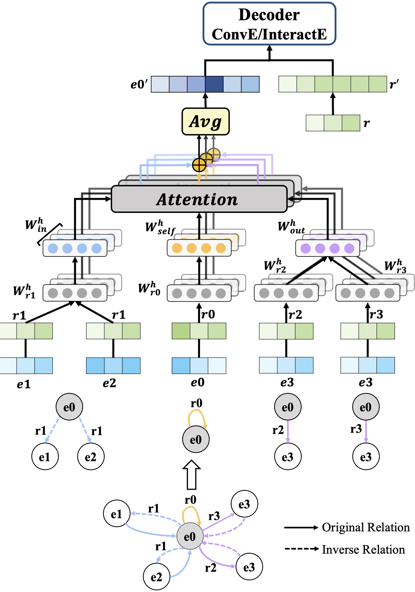

# RAGAT: Relation Aware Graph Attention Network for Knowledge Graph Completion

## Overview


We propose a Relation Aware Graph ATtention network (RAGAT) that constructs separate message functions for different relations. Specifically, we introduce relation specific parameters to augment the expressive capability of message functions, which enables the model to extract relational information in parameter space. To validate the effect of relation aware mechanism, RAGAT is implemented with a variety of relation aware message functions. Experiments show RAGAT outperforms state-of-the-art link prediction baselines on standard FB15k-237 and WN18RR datasets.

## Dependencies
- Pytorch 1.5

## Datasets
- FB15k-237
- WN18RR

## Training model
```bash
# FB15k-237
python run.py -epoch 1500 -name test_fb -model ragat -score_func \
interacte -opn cross -gpu 0 -data FB15k-237 -gcn_drop 0.4 -ifeat_drop 0.4 \
-ihid_drop 0.3 -batch 1024 -iker_sz 9 -attention True -head_num 2
# WN18RR
python run.py -epoch 1500 -name test_wn -model ragat -score_func \
interacte -opn cross -gpu 0 -data WN18RR -gcn_drop 0.4 -ifeat_drop 0.2 \
-ihid_drop 0.3 -batch 256 -iker_sz 11 -iperm 4 -attention True -head_num 1
```

## Acknowledgement
The project is built upon [COMPGCN](https://github.com/malllabiisc/CompGCN)
